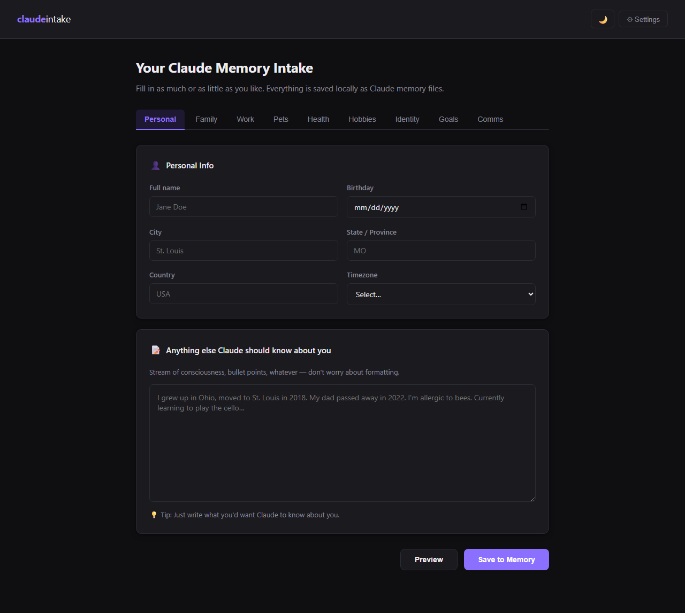

# claude-intake

A local Flask web app for generating **Claude Code memory files**. Bootstrap your `~/.claude/memory/` directory and `MEMORY.md` index from a tabbed form instead of hand-writing YAML frontmatter.



## What it does

Claude Code reads memory files to personalize how it behaves across sessions: your name, your work, your family, how you prefer to communicate. Writing those files by hand means remembering the frontmatter schema, keeping the index in sync, and being disciplined about consistency over time.

claude-intake gives you a nine-tab form (Personal, Family, Work, Pets, Health, Hobbies, Identity, Goals, Communication), validates the input, writes properly-formatted memory files to `~/.claude/memory/`, and rebuilds the `MEMORY.md` index automatically. Edits merge instead of clobbering, so you can come back next week and add a hobby without losing yesterday's work.

Everything runs locally on `127.0.0.1`. Nothing is transmitted to the Anthropic API or anywhere else.

## Features

- Nine pre-built memory categories with curated fields for each
- YAML frontmatter generated automatically and consistently
- Re-entry safe: editing a category merges with the existing file rather than overwriting it
- `MEMORY.md` index file kept in sync on every save
- Configurable output path via the in-app Settings panel
- Pure local Flask app, no external API calls, no telemetry

## Quick start

```
git clone https://github.com/6a6f686e6e79/claude-intake.git
cd claude-intake
python3 -m venv .venv && source .venv/bin/activate
pip install -r requirements.txt
python app.py
```

Open <http://127.0.0.1:5001>, fill in the tabs, click **Save to Memory**.

By default, files are written to `~/.claude/memory/`. Use the ⚙ Settings panel in the header to change the path.

## Standalone (no install)

For non-technical users who just want to seed claude.ai memory without setting up Python, [`standalone.html`](standalone.html) is a single self-contained file that runs entirely in the browser. Download it, double-click to open, fill in the form, click **Generate** — a memory bootstrap is copied to your clipboard, ready to paste into a claude.ai conversation.

The standalone is generated from the same template as the Flask version, so the fields stay in sync. To regenerate after editing the template or CSS:

```
python3 tools/build_standalone.py
```

The Claude Code path is also supported as a secondary mode: pick the "Claude Code" target and **Generate** downloads a ZIP of `.md` files to extract into `~/.claude/memory/`.

## How Claude Code uses these files

When Claude Code starts in a project directory, it reads `CLAUDE.md` (project-level memory committed alongside the code) and, separately, files in `~/.claude/memory/` (user-level memory that follows you between projects). The combination gives Claude context about both the codebase and the person working in it.

claude-intake handles the user-level side: the persistent facts about you that should be available in every project, regardless of what you're working on. For project-level `CLAUDE.md` files, write those by hand alongside the code they describe.

For the underlying file format and lookup behavior, see the [Claude Code memory documentation](https://docs.claude.com/en/docs/claude-code/memory).

## Screenshots

| Tab | Preview |
| --- | --- |
| Personal | [01-personal.png](screenshots/01-personal.png) |
| Family | [02-family.png](screenshots/02-family.png) |
| Work | [03-work.png](screenshots/03-work.png) |
| Pets | [04-pets.png](screenshots/04-pets.png) |
| Health | [05-health.png](screenshots/05-health.png) |
| Hobbies | [06-hobbies.png](screenshots/06-hobbies.png) |
| Identity | [07-identity.png](screenshots/07-identity.png) |
| Goals | [08-goals.png](screenshots/08-goals.png) |
| Comms | [09-comms.png](screenshots/09-comms.png) |

All screenshots use a fictional persona ("Riley Quinn"). No real personal data is shown.

## Regenerating screenshots

```
pip install playwright
playwright install chromium
python app.py &        # run the server in the background
python tools/take_screenshots.py
```

## License

MIT. See [LICENSE](LICENSE).
